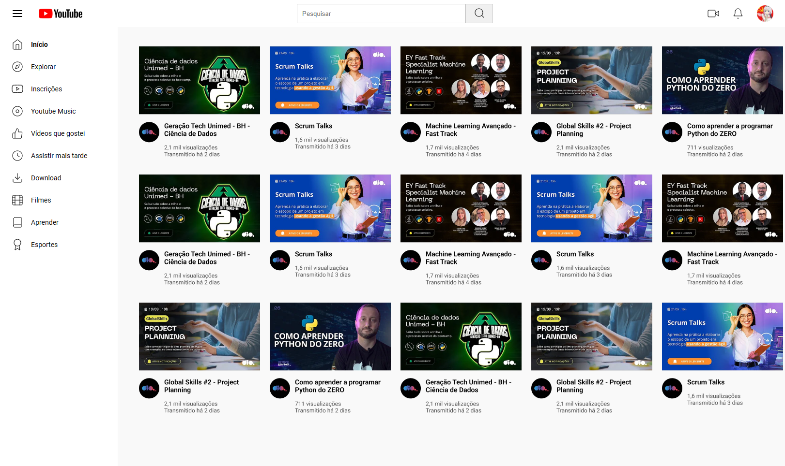

<h1 align="center">Clone Youtube</h1>

  

## 🚀 Tecnologias

Esse projeto foi desenvolvido com as seguintes tecnologias:

- HTML e CSS
- Git e Github

## 💻 Projeto
Projeto criado para o desafio DIO, clonar a platamorma do Youtube de forma estática, utilizando apenas HTML e CSS, buscando colocar em prática os conceitos de Grid Layout, durante o desenvolvimento do projeto optei por separar o Grid Continer em apenas 2 colunas, sendo uma para o Aside e outra para o Section, onde contém o conteúdo principal.
A parte da section também foi estrutura utilizando o Grid Layou, na qual optei por dividir o conteúdo em 3 linhas e 5 colunas para alocar as imagens.

## :memo: Licença